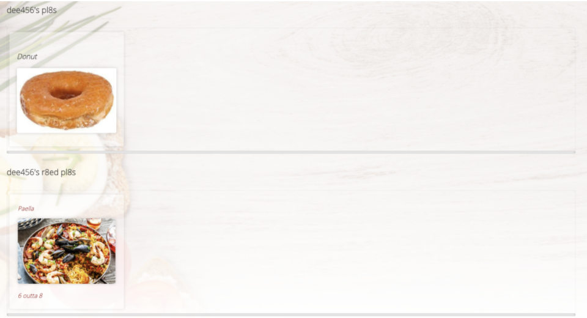
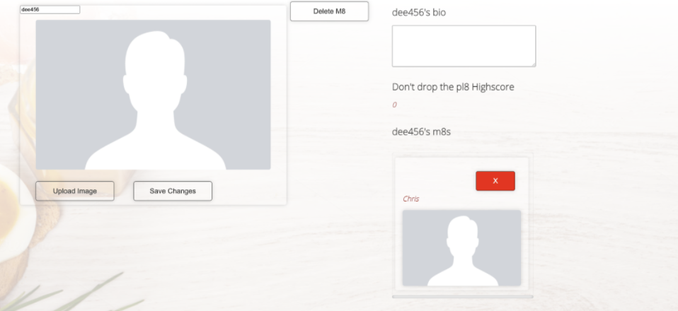

# Project 3: R8 MY PL8

# Overview

Project 3 was another group-based assignment and our first chance at handling both the front and backend of an application to be able to deliver a full stack app after **10 days with the use of React, mongoDB and Express.** We went for a social media approach with the focus being around meal dishes. Users would be able to sign up for an account and upload their dishes alongside instructions and others would then be able to assign a rating to that meal. **I mainly focused on the backend of the project, functionality of the profile page and SASS.**


You can have full access to the project by clicking [**here!**](https://rate-my-pl8.netlify.app/)

# Brief

* **Build a full-stack application** by making your own backend and your own front-end
* **Use an Express API** to serve your data from a Mongo database
* **Consume your API with a separate front-end** built with React
* **Be a complete product** which most likely means multiple relationships and CRUD functionality for at least a couple of models
* **Implement thoughtful user stories/wireframes** that are significant enough to help you know which features are core MVP and which you can cut
* **Have a visually impressive design** to kick your portfolio up a notch and have something to wow future clients & employers. **ALLOW** time for this.
* **Be deployed online** so it's publicly accessible.

## Team

* [Dominic Reynolds](https://github.com/dominicreynolds97)
* [Chirs Wood](https://github.com/Chrisw00d1)
* [Devante Spaine](https://github.com/dee912)


# Technology used

* React
* Node.js
* Express
* MongoDB/Mongoose
* SASS
* Bulma (removed during final steps)
* Axios
* Nodemon
* HTTP-proxy-middleware
* Bcrypt
* jsonwebtoken
* Git/GitHub
* Cloudinary 
* Heroku
* Netlify


## The plan

Before beginning we had a meeting to discuss where each person would feel comfortable hitting the ground running and broke the workload into the following:

* Dom: 
* Backend: responsibility of the models scheme.
* Frontend: Authentication, app navigation and the app game, show page.
* Chris: 
* Backend: database section, handling the data and seeding. 
* Frontend: Homepage, adding and deleting a friend, authentication, profile page, comment section 
* Devante: 
* Backend: focused on the controllers required, error handling and bcrypt.
* Frontend: Profile page, SASS, image uploading and plate index page and show page, authentication. 

Note that we helped each other where needed and all played an equal part in the authentication process.

We then began whiteboarding out our idea and what the general look for the site should be. We had a basic layout for our models knowing that they would be more detailed when actually working on the backend.

## Wireframes

### Home/index page

Our home page and game came into the plan after our initial plan. We kept true to the layout of our pages from concept to final deployment.

### Show page


### Profile page


# The process

## Backend (Day 1 to 3)

* Dom: responsibility of the models scheme.
* Chris: database section, handling the data and seeding. 
* Devante: focused on the controllers required, error handling and bcrypt.

Between the 3 of us we hit the ground running in getting the backend up and done in 3 days. Day 1 was spent on setting up our models, database and controllers, day 2 we began adding in bcrytion, custom error handling and seeding our data and day 3 we went over our code checking for missing pieces and giving it a small clean up.

### Models

For our models we had embedded and referenced data involved in each. An example of this, in the user model (m8’s) would be for the m8s and r8dPl8s keys.

```JavaScript
const m8 = new Schema({
 username: { type: String, required: true, unique: true },
 email: { type: String, required: true, unique: true  },
 avatar: { type: String, required: true },
 password: { type: String, required: true },
 
 m8s: { type: [Schema.ObjectId], ref: 'M8', required: false },
 highScore: { type: Number, required: false },
 r8dPl8s: { type: [Schema.ObjectId], ref: 'Pl8', required: false },
 bio: { type: String, required: false },
 deleted: { type: Boolean, required: true },
})

```

This can also be seen in the pl8s model:

```JavaScript
const pl8 = new Schema({
 name: { type: String, required: true },
 origin: { type: String, required: true },
 description: { type: String, required: true },
 r8ings: {
   type: [r8ing],
   required: true, 
 },
 image: { type: String, required: true },
 ingredients: { type: [String], required: true },
 recipe: { type: [String], required: true },
 m8: { type: Schema.ObjectId, ref: 'M8', required: true },
 prepTime: { type: Number, required: true },
 cookTime: { type: Number, required: true },
 comments: { type: [comment] },
})
 

```

### Controllers

Controllers were set up for users, food dishes and comments. For the registration controller we included an element for mimicking the reactivation process other social media site use of just flipping a boolean, it checks to see if the email is already in use and if it is then checks to see if the user has been 'deleted'. If it is true then the account gets reactivated and if it isn't then the error that the email is already in use error is sent instead:

``` JavaScript

 async function register(req, res, next) {
  try {
    const m8 = await M8.findOne({ email: req.body.email })
    console.log(m8)
    if (m8) {
      if (m8.deleted) {
        req.body.deleted = false
        if (req.body.password === '') throw new NoPassword('A Password is Required')
        req.body.password = bcrypt.hashSync(req.body.password, bcrypt.genSaltSync())
        const reactivatedM8 = await m8.updateOne(req.body, { new: true })
        res.status(201).json(reactivatedM8)
      } else {
        throw new EmailNotUnique('This email is taken')
      }
    } else {
      req.body.deleted = false
      req.body.highScore = 0
      const newM8 = await M8.create(req.body)
      res.status(201).json(newM8)
    }
  } catch (error) {
    next(error)
  }
}

```

## Frontend (Day 3 to 9)

* Dom: Authentication, app navigation and the app game, show page.
* Chris: Homepage, adding and deleting a friend, authentication, profile page, comment section.
* Devante: Profile page, SASS, image uploading and plate index page and show page, authentication.

### Profile page
The profile page was one of our original and main goal pages to set up correctly.

* The profile page was a fun page to work on alongside Chris. 
* I had a good understanding of how to layout the page with SASS and get information to display.
* Chris was more comfortable working on the editing and delete function of the page and was the one who gave the idea of having an add friend option. 
* We set up the page to show friends, plates created by the user and plates rated by the user:
* This was done by mapping through all m8s and displaying them in the div.
* Originally it simply showed every user as a m8 and added them to the list.
* Chris came up with making it more personal with the add friends option and only showing activeM8s in the list.

``` JavaScript
export default function ProfileM8s({ formdata, m8s, setM8 }) {
 const [activeM8s, setActiveM8s] = React.useState(false)
 
 React.useEffect(() => {
 }, [activeM8s])
 
 
 return (
   <section>
     <div className="media-content">
       <h2>{formdata.username}&apos;s m8s</h2>
     </div>
     <br />
     <div className="containerScroll">
       {m8s && m8s.length > 0 && (
         m8s.map(m8 => (
           <M8sCard key={m8} m8Id={m8} setNewM8={setM8} setActiveM8s={setActiveM8s} />
         ))
       )}
       {!activeM8s && (
         <div className="cardScroll">
           <p>No m8s</p>
           
         </div>)
       }
     </div>
   </section>
 )
}
```

* For displaying the users own plates I made sure the ID of the user and the ID of the plate owner matched.
```JavaScript
const ownPl8s = (pl8 && m8 && pl8.filter(pl8s => pl8s.m8 === m8._id))
```
* On the user model this is a r8dPl8s key with when a user assigned a rating to any plate that plate is added to the array
* I ran a map through this and added a turnery in order to place a default placement card if the array length was 0.
* After running the map the plates were then displayed.
```JavaScript
<div className="containerScroll">
       {r8dPl8s && r8dPl8s.length > 0 ? (
         r8dPl8s.map(pl8 => (
           <div key={pl8._id} >
             <div  className="cardScroll">
               <Link to={`/pl8s/${pl8._id}` } >
                 <p className="title is-4">{pl8.name}</p>
                 
                 <p>{findR8ing(pl8.r8ings).r8ing} outta 8</p>
               </Link>
             </div>
           </div>
         ))
       ) : (
         <div className="cardScroll">
           <p className="title is-4">This m8&apos;s r8ed no pl8s</p>
           
         </div>)
       }
     </div>
```




* Chris made it possible that a user could edit or delete their profile and remove friends





### Index page

The index page was originally going to be our homepage but after finishing the backend we decided to make a homepage separate and the first page after to be the index. We described it as unwrapping a present as the home page needs to be interacted with before you get the option to move forward.

* The layout was simple with a search bar at the top which will filter as you type.


* The search bar was handled with a filter:

```JavaScript
const handleChange = (e) => {
   setSearchTerm(e.target.value)
 }
 
return (
   <motion.div
     initial={{ opacity: 0 }}
     animate={{ opacity: 1 }}
     exit={{ opacity: 0 }}
   >
     <div className="cardIndex">
       <div className="container">
         <input
           className="input is-rounded"
           type="text"
           placeholder="Find pl8s"
           onChange={handleChange}
         />
         <div className="index">
           {pl8s && pl8s.filter((pl8) => {
             if (searchTerm === '') {
               return pl8
             } else if (pl8.name.toLowerCase().includes(searchTerm.toLowerCase())) {
               return pl8
             }
           }).map(pl8 => (
             <PL8Card
               key={pl8._id}
               {...pl8}
             />
           ))}
         </div>
       </div>
     </div>
 
   </motion.div>
 )
 

```
* First the filter is used to return either all the plates when the input value is ‘’ or false
* Or else return the value that is typed into the input.
* Whilst the search is in progress all plate names will be fully lowercase, regardless of how * they appear.
* The input value the user types will be read as only lowercase regardless if they use * uppercase letters.
* This is how the match will be found: lowercase name = lowercase searched value.
* Then the map after the filter is why we can see all the plates displayed.

### Show page

* The show page was created after we got the create a plate form working correctly as we wanted all the relevant data to be displayed for users to see. 
* After that the setup was pretty simple with the more difficult parts being the comment section.


# Challenges and wins

## Challenges

For me a challenge during this project was imposter syndrome at times. Working with Dom and Chris was amazing and I really enjoyed the process overall, plus they really helped with areas I struggled with, but with them having more coding experience and a better understanding it was difficult at times.

I explained this to them and they were more than happy to break down their code for me on the areas I was asking about and helped me get a solid understanding of it all. I’d happily work with both of them again. 

## Wins

I feel this was a big learning curve project and I picked up new skills and managed to get things working which I couldn’t have thought about just a few weeks prior. I’m proud of the project overall and really like the look and feel of it whilst using the site myself.

# What was learnt 

* Learned how to use Git to handle conflicts whilst merging.
* How to work in a group with the use of Git branches.
* How to better use filters and maps for page layouts and displaying data.
* Styling and using SASS for a full project without any assistance of a framework.

# Bugs

* As we opted for pure SASS we never had time in the end to make it mobile friendly, although not a bug it is a current fixture required.

# Future development

* Add in a messaging service between friends.
* Have friend requests instead of just an instant add.
* Filter plate by cooking and prep time and origin.
* Mobile friendly design.